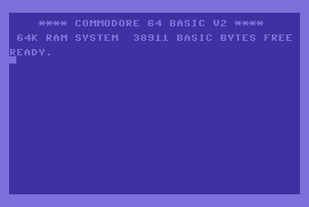

# Nanobasic Interpreter in Rust
This Project is an implementation of the Nanobasic Interpreter in the programming language Rust.
Nanobasic is very simple dialect of BASIC based on [Tiny BASIC](https://en.wikipedia.org/wiki/Tiny_BASIC).

Why? - because it was fun and a nice way of learning the Rust plus some computer science :)

BASIC was also the first programming i learned way back on the Commodore C64



The picture is from [here](https://www.c64-wiki.de/wiki/BASIC)


## Nanobasic in the Browser

[NanoBasic on Github Pages](https://loscommodore.github.io/NanoBasicRust/)

On this website you can test and run the interpreter in the browser. you can load from a list of demo programs or enter your own program.

The website is also written in Rust using the framework [Leptos](https://leptos.dev/). The deployement of the static website on Github Pages is done via Github Actions. The Interpreter is running as a Webassembly-Module (WASM) in the browser.

## Inspired by the Book "Computer Science From Scratch" by David Kopec

https://davekopec.com/

[Book](https://nostarch.com/computer-science-from-scratch)

[Github](https://github.com/davecom/ComputerScienceFromScratch)

```
The book, intended for intermediate to advanced Python programmers, features 7 projects of varying complexity from the realm of interpreters, emulators, computer art, and simple machine learning.
```
**In Chapter 2**, the Nanobasic Interpreter is created in Python as an example of how interpreters work. In order to learn activly I took this code as a blueprint, translated it to Rust and adapted it to my usecase.

### Podcast Epidose
I learned about this book in this podcast episode from "Talk Python To Me":

[Episode from Talk Python To Me](https://talkpython.fm/episodes/show/529/computer-science-from-scratch)
